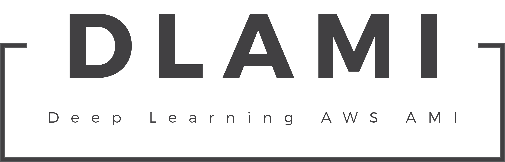

	
	

## Deprecation Note
This AMI is officially deprecated as the ecosystem has evolved and many stable and updated versions are available currently from official channels.

## How to find?
Under community AMI, search for `DLAMI.V1`. It is currently only available in `Oregon`. 

## DLAMI.V1 (latest stable AMI)
- Python 2.7 and Python 3.5
- PyTorch 0.1.12
- TensorFlow 1.0.1
- Theano 0.8.2
- Keras 2.0.4
- MXNet 0.9.3
- Lua 
- Torch
- CNTK
- Caffe
- CUDA release 7.5
- CuDNN 5.1

## FAQs (Relating to Driver Issues)
1. Error: `Failed to initialize NVML: Driver/library version mismatch`
	- Run `sudo reboot`. 
2. Error: `NVIDIA-SMI has failed because it couldn't communicate with the NVIDIA driver. Make sure that the latest NVIDIA driver is installed and running.`
	- Run `sudo apt-get update`.
3. Error: `Mismatch of Kernel with DSO`
	- Run `sudo reboot`.

## Regions (DLAMI.V1)
- Oregon `ami-7e3a5b1e`

## DLAMI Instance Specifications
- 50 GB EBS
- Can be used on any GPU instances including the new p2 instances.
- User: ec2-user 
	- For example, when you ssh into your instance you would key in `ssh -i name_of_key.pem ec2-user@public_ip_or_dns`

## Have a bug to report?
Raise an issue here and we'll update DLAMI to make sure it works or enable it across different regions.

## Information
This was maintained by [Ritchie Ng](http://www.ritchieng.com/) and [Jie Fu](http://bigaidream.github.io/) from NExT Search Centre, NUS Smart Systems Institute, National University of Singapore. 

And I would like to thank Amazon for their donation of AWS credits for our research that led to this useful byproduct deployed by people across the world.

## License
MIT
